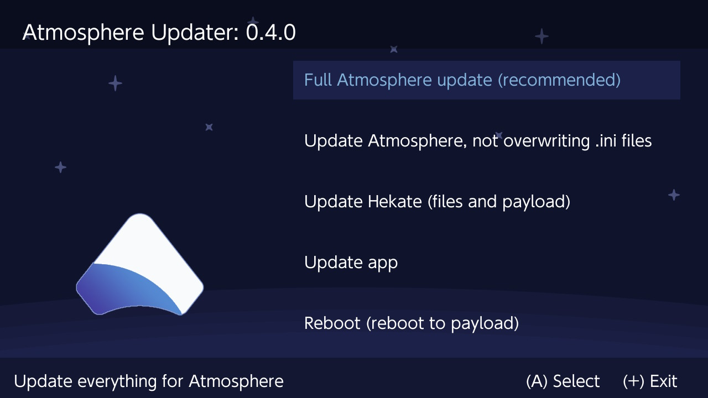

# THIS PROJECT IS ARCHIVED.

I am no longer updating any of my switch homebrew apps. This also means that there will be no more public releases made by me.

Thank you to everyone that was kind to me along the way.

----

## Atmosphere-Updater

Update Atmosphere cfw from within your switch!

----

# Install

Download the the latest release from [here](https://github.com/ITotalJustice/atmosphere-updater/releases).

Move the downloaded .nro onto you nintendo switch sd card inside the folder **/switch/atmosphere-updater**.

That's it!

----

# Usage

__**The app currently has 5 main options.**__

**Full Atmosphere Update:**

* Downloads the latest Atmosphere release and installs everything from that release.

**Update Atmosphere, not overwriting .ini files:**

* Downloads the latest Atmosphere release and installs everything from that release ignoring .ini files.
* This option will still install any missing .ini files, ensuring that the update will function correctly.

**Update Hekate:**

* Installs the latest release of Hekate.
* Option to install latest Atmosphere as well, when selecting update Hekate.
* If option to update Hekate + Atmosphere is selected, the new fusee-primary.bin is copied to **/bootloader/payloads/fusee-primary.bin**.
* Replaces **/atmosphere/reboot_payload.bin** with the new Hekate payload.
* Copies new Hekate payload to **/bootloader/update.bin**.

**Update App:**

* Downloads the latest version of this app straight from github!
* Deletes the previous old version.

**Reboot (reboot to payload):**

* Reboots the switch, loading the payload from **/atmosphere/reboot_payload.bin**.
* This is recommended after install Atmosphere.
* Updating Atmosphere / Hekate automatically includes the needed **reboot_payload.bin**.

----

# Build

Install the Devkitpro tool chain from [here](https://devkitpro.org/wiki/Getting_Started).

 Using pacman (installed with devkitpro) install the following libraries:
* switch-curl
* switch-freetype
* switch-sdl2
* switch-sdl2_gfx
* switch-sdl2_image
* switch-sdl2_ttf
* switch-zlib

If you have any problems building, feel free to open an issue including any build errors.
 
----

# Special Thanks!

[toph](https://github.com/sudot0ph) for the design of the app icon, as well as the most icons used within the app!

[Black Rabbit](https://github.com/BlackRabbit22) for the design of the plus and error icon (and the idea for this app)!

[bandithedoge](https://github.com/bandithedoge) for the background!

[KrankRival](https://github.com/KranKRival) for the initial sys / ams version pr (and for motivating me to work on touch controls)!

----

# Patreon

Feel free to support me on patreon, I would really appreciate it!

